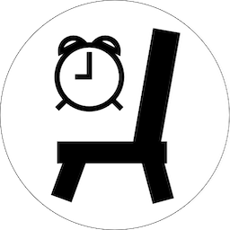

# Stand Up, Lazy!
<div style="text-align: center;"><p></p>
<p style="font-style: italic; font-size: 3em">The best sitting position is the next one.</p>
</div>

## Introduction
All too often I find myself not using my fancy standing desk at all during the day.
So instead of using 50 timers or spending 20 seconds to find a suitable app that reminds me regularly,
I spent a good 3 hours and a good chunk of ChatGPTs' saneness to write this simple application.


To install:
```
pyinstaller stand_up_lazy.spec
```