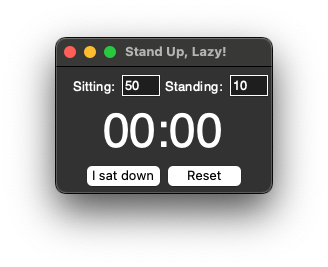

# Stand Up, Lazy!
<div align="center" style="text-align: center;"><p></p>
<p style="font-style: italic; font-size: 3em">The best sitting position is the next one.</p>
</div>

## Introduction
All too often I find myself not using my fancy standing desk at all during the day.
So instead of using 50 timers or spending 20 seconds to find a suitable app that reminds me regularly,
I spent a good 3 hours and a good chunk of ChatGPTs' saneness to write this simple application.

<div align="center" style="text-align: center;"></div>
I ended up with a small application that takes your preferred sitting and standing times and sends a notification
whenever you should change your pose.

## Usage
Either use poetry or install the dependencies from the `requirements.txt`.
Afterward you should be able to start the application using:
```
python stand_up_lazy.py
```

## Bundled application
As having to run the application through python every time, you can also bundle it to an executable.
To build the bundle make sure you have pyinstaller installed and call:
```
pyinstaller stand_up_lazy.spec
```
> This has only been tested on macOS